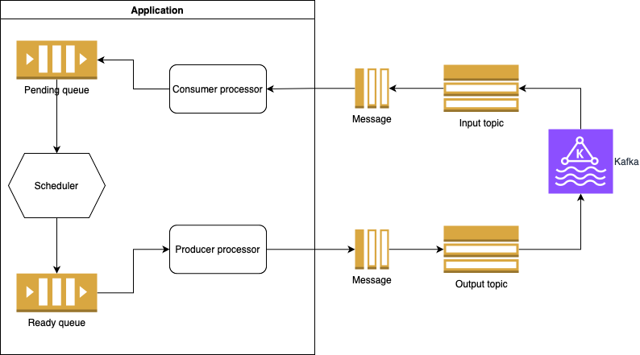

# processor: A scalable golang application of processing kafka messages

The processor is a microservice that lets you consume messages from Kafka, perform some actions on them,
and store them in another kafka topic.
It is designed to run multiple consumers and multiple producers as well.
Service uses [the scheduler library](https://github.com/igor35hh/scheduler) as a workers pool for message processing.

## Quick Start
```
go get github.com/igor35hh/processor
```

```bash
export varname=value
export KAFKA_SERVERS=localhost
export KAFKA_GROUP_ID=myGroup
export KAFKA_CONSUMER_TOPICS=input_topic
export KAFKA_CONSUMER_TOPIC=output_topic
export KAFKA_OFFSET_RESET=earliest
export KAFKA_AUTO_OFFSET_STORE=false
export WORKER_POOL=6
export TASKS_PICK_UP=2
export CONSUMERS_COUNT=2
export PRODUCERS_COUNT=2
  
```

```golang
go run ./cmd/main.go
  
```

## Concepts

- **App**: The entry point of initialisation and running application.
- **Service**: The service provides business logic to interact with Kafka client.
- **Message**: The Kafka message that will be processed. It contains logic to validate itself.
- **Consumer**: The Kafka message consumer. It consumes messages and acknowledges messages that were successfully consumed.
- **Producer**: The Kafka producer. It commits messages to specific Kafka topic.

## Scalability
Service can be scaled horizontally by adding new Kafka consumers and producers along with extending the pool of workers.

## Design and technical features
By storing the offsets manually after completely processing each message, we can ensure atleast once processing.
The service uses the sane group_id for Kafka consumers along with topic partitioning. It will allow consumers to read different sets of messages, thereby significantly increasing the throughput. Note that the count of consumers should be less or equal to the count of topic partitionings.
The workers pool uses a linked list structure as a pending queue. I would use just slice, but linked will allow us to add new logic, for example, delete messages.

## The Architecture diagram
<p align="center">
  
  <br/>
</p>

## Assumptions
Maybe batch processing can be faster, but this approach needs testing and comparison.
I would store failed messages in an external queue for subsequent processing and analysis.

## Requirements, tasks break down
1. The pool of workers. It should be a universal solution. Accept function with a structure that will allow us to save the result of processing and return it to the producer. 
2. I think we can escape to use channels and instead inject the pointer on instance of worker pool to coroutines.
3. Pending and Ready queue. I think linked list will be the good option in the scope of extension, but it will work under concurent access. That's why we need to use mutex.
4. Transaction, we need it on the Kafka side, to ensure that the consumed message was processed successfully. Also, it will help us if the service restarts.
5. The consumer and producer should be running independently and be horizontally scalable. In other words we should add them as goroutines. The count of them should be in the config.
6. Layered architecture: we should follow this design approach to ensure that service will be extensible and maintainable.
